# Manual Técnico - Sistema Barber Shop Frontend

## 📋 Información General

**Nombre del Sistema:** Barber Shop - Sistema de Reservas Frontend  
**Versión:** 1.0.0  
**Fecha de Creación:** 18 de Agosto de 2025  
**Tecnología Principal:** Angular 20+ con TypeScript  
**Arquitectura:** SPA (Single Page Application) con Componentes Standalone  
**Repositorio:** front-end_barbershop  
**Propietario:** JhojanBallesteros  

---

## 🔧 Prerrequisitos de Instalación

### Requerimientos del Sistema

#### Software Base Requerido:
- **Node.js:** >= 18.17.0 LTS
- **npm:** >= 9.6.7 (incluido con Node.js)
- **Git:** >= 2.30.0
- **Angular CLI:** >= 20.0.0

#### Sistemas Operativos Compatibles:
- Windows 10/11 (x64)
- macOS 10.15+ (Catalina o superior)
- Ubuntu 18.04+ / Debian 10+
- Red Hat Enterprise Linux 8+

#### Hardware Mínimo:
- **RAM:** 8 GB mínimo, 16 GB recomendado
- **Almacenamiento:** 2 GB libres para el proyecto
- **Procesador:** Intel i5 / AMD Ryzen 5 o superior

### Navegadores Compatibles:
- Chrome 100+
- Firefox 100+
- Safari 15+
- Edge 100+

---

## 🏗️ Frameworks y Tecnologías

### Frontend Framework
```json
{
  "framework": "Angular",
  "version": "20.1.0",
  "architecture": "Standalone Components",
  "language": "TypeScript 5.8.2",
  "buildTool": "Angular Build (esbuild)"
}
```

### Dependencias Principales
```typescript
// Core Angular
"@angular/core": "^20.1.0"
"@angular/common": "^20.1.0"
"@angular/router": "^20.1.0"
"@angular/forms": "^20.1.0"
"@angular/animations": "^20.1.7"

// UI Components
"@angular/material": "^20.1.6"
"@angular/cdk": "^20.1.6"

// State Management
"@ngrx/store": "^20.0.0"
"@ngrx/effects": "^20.0.0"
"@ngrx/entity": "^20.0.0"
"@ngrx/store-devtools": "^20.0.0"

// Reactive Programming
"rxjs": "~7.8.0"

// Zone.js for Change Detection
"zone.js": "~0.15.0"
```

### Herramientas de Desarrollo
```typescript
// Testing
"jasmine-core": "~5.8.0"
"karma": "~6.4.0"
"karma-chrome-launcher": "~3.2.0"
"karma-coverage": "~2.2.0"

// Build Tools
"@angular/build": "^20.1.6"
"@angular/cli": "^20.1.6"
"@angular/compiler-cli": "^20.1.0"

// Code Quality
"prettier": "Configurado para Angular"
"typescript": "~5.8.2"
```

---

## 📐 Estándares de Desarrollo

### Convenciones de Nomenclatura

#### Archivos y Carpetas:
```
kebab-case para archivos y carpetas
ejemplo: user-profile.component.ts
ejemplo: auth-service.service.ts
```

#### Clases y Interfaces:
```typescript
// PascalCase para clases e interfaces
export class UserService { }
export interface BookingRequest { }

// camelCase para propiedades y métodos
getUserById(id: string): Observable<User>
isUserAuthenticated: boolean
```

#### Constantes y Enums:
```typescript
// UPPER_SNAKE_CASE para constantes
const API_BASE_URL = 'https://api.example.com';

// PascalCase para Enums
export enum BookingStatus {
  PENDING = 'pending',
  CONFIRMED = 'confirmed'
}
```

### Estructura de Proyecto
```
src/
├── app/
│   ├── core/                    # Servicios singleton y utilidades
│   │   ├── guards/             # Guards de autenticación y autorización
│   │   ├── interceptors/       # HTTP Interceptors
│   │   ├── models/            # Modelos de datos TypeScript
│   │   └── services/          # Servicios principales
│   ├── features/              # Módulos de funcionalidades
│   │   ├── auth/             # Autenticación
│   │   ├── booking/          # Sistema de reservas
│   │   ├── home/             # Página principal
│   │   ├── services/         # Catálogo de servicios
│   │   └── barbers/          # Gestión de barberos
│   ├── shared/               # Componentes reutilizables
│   │   ├── components/       # Componentes compartidos
│   │   └── validators/       # Validadores personalizados
│   └── environments/         # Configuraciones por ambiente
```

### Patrones de Diseño Implementados

#### 1. **Dependency Injection**
```typescript
@Injectable({
  providedIn: 'root'
})
export class AuthService {
  constructor(private http: HttpClient) {}
}
```

#### 2. **Observable Pattern**
```typescript
getCurrentUser(): Observable<User | null> {
  return this.http.get<User>('/api/user/current');
}
```

#### 3. **Lazy Loading**
```typescript
{
  path: 'booking',
  loadChildren: () => import('./features/booking/booking.routes')
    .then(m => m.bookingRoutes)
}
```

#### 4. **Interceptor Pattern**
```typescript
export const authInterceptor: HttpInterceptorFn = (req, next) => {
  const token = getAuthToken();
  if (token) {
    req = req.clone({
      headers: req.headers.set('Authorization', `Bearer ${token}`)
    });
  }
  return next(req);
};
```

---

## 🎯 Diagrama de Casos de Uso

```mermaid
graph TB
    Cliente[Cliente] 
    Barbero[Barbero]
    Admin[Administrador]
    
    subgraph "Sistema Barber Shop"
        UC1[Registrarse]
        UC2[Iniciar Sesión]
        UC3[Ver Servicios]
        UC4[Reservar Cita]
        UC5[Ver Disponibilidad]
        UC6[Cancelar Reserva]
        UC7[Ver Historial]
        UC8[Actualizar Perfil]
        UC9[Gestionar Horarios]
        UC10[Ver Agenda]
        UC11[Confirmar Citas]
        UC12[Gestionar Servicios]
        UC13[Ver Reportes]
        UC14[Gestionar Usuarios]
    end
    
    Cliente --> UC1
    Cliente --> UC2
    Cliente --> UC3
    Cliente --> UC4
    Cliente --> UC5
    Cliente --> UC6
    Cliente --> UC7
    Cliente --> UC8
    
    Barbero --> UC2
    Barbero --> UC9
    Barbero --> UC10
    Barbero --> UC11
    Barbero --> UC8
    
    Admin --> UC2
    Admin --> UC12
    Admin --> UC13
    Admin --> UC14
    Admin --> UC8
```



### Descripción de Casos de Uso

#### **Cliente:**
- **UC1 - Registrarse:** Crear nueva cuenta en el sistema
- **UC2 - Iniciar Sesión:** Autenticarse en el sistema
- **UC3 - Ver Servicios:** Consultar catálogo de servicios disponibles
- **UC4 - Reservar Cita:** Crear nueva reserva seleccionando servicio, barbero y horario
- **UC5 - Ver Disponibilidad:** Consultar horarios disponibles de barberos
- **UC6 - Cancelar Reserva:** Cancelar citas programadas
- **UC7 - Ver Historial:** Consultar historial de citas y servicios
- **UC8 - Actualizar Perfil:** Modificar información personal

#### **Barbero:**
- **UC9 - Gestionar Horarios:** Configurar disponibilidad y horarios de trabajo
- **UC10 - Ver Agenda:** Consultar citas programadas
- **UC11 - Confirmar Citas:** Aprobar o rechazar reservas pendientes

#### **Administrador:**
- **UC12 - Gestionar Servicios:** CRUD de servicios y precios
- **UC13 - Ver Reportes:** Acceder a métricas y estadísticas
- **UC14 - Gestionar Usuarios:** CRUD de usuarios y roles

---

## 🗄️ Modelo de Entidad de Base de Datos


---

## 📖 Diccionario de Datos

### Tabla: USERS
| Campo | Tipo | Restricciones | Descripción |
|-------|------|---------------|-------------|
| id | UUID | PK, NOT NULL | Identificador único del usuario |
| email | VARCHAR(255) | UNIQUE, NOT NULL | Correo electrónico del usuario |
| password_hash | VARCHAR(255) | NOT NULL | Hash de la contraseña |
| first_name | VARCHAR(100) | NOT NULL | Nombre del usuario |
| last_name | VARCHAR(100) | NOT NULL | Apellido del usuario |
| phone | VARCHAR(20) | NOT NULL | Número telefónico |
| date_of_birth | DATE | NULL | Fecha de nacimiento |
| avatar_url | VARCHAR(500) | NULL | URL de la foto de perfil |
| role | ENUM | NOT NULL | Rol: 'client', 'barber', 'admin' |
| preferences | JSON | NULL | Preferencias del usuario |
| created_at | TIMESTAMP | NOT NULL | Fecha de creación |
| updated_at | TIMESTAMP | NOT NULL | Fecha de última actualización |

### Tabla: BARBERS
| Campo | Tipo | Restricciones | Descripción |
|-------|------|---------------|-------------|
| id | UUID | PK, NOT NULL | Identificador único del barbero |
| user_id | UUID | FK, UNIQUE, NOT NULL | Referencia al usuario |
| bio | TEXT | NULL | Biografía del barbero |
| specializations | JSON | NULL | Lista de especializaciones |
| experience_years | INTEGER | DEFAULT 0 | Años de experiencia |
| rating | DECIMAL(3,2) | DEFAULT 0.00 | Calificación promedio |
| total_reviews | INTEGER | DEFAULT 0 | Total de reseñas |
| working_hours | JSON | NOT NULL | Horarios de trabajo |
| unavailable_dates | JSON | NULL | Fechas no disponibles |
| is_active | BOOLEAN | DEFAULT TRUE | Estado activo |

### Tabla: SERVICES
| Campo | Tipo | Restricciones | Descripción |
|-------|------|---------------|-------------|
| id | UUID | PK, NOT NULL | Identificador único del servicio |
| name | VARCHAR(200) | NOT NULL | Nombre del servicio |
| description | TEXT | NULL | Descripción detallada |
| duration_minutes | INTEGER | NOT NULL | Duración en minutos |
| price | DECIMAL(10,2) | NOT NULL | Precio del servicio |
| category | ENUM | NOT NULL | Categoría: 'haircut', 'beard', 'styling', 'treatment', 'package' |
| image_url | VARCHAR(500) | NULL | URL de la imagen |
| requirements | JSON | NULL | Requisitos especiales |
| features | JSON | NULL | Características incluidas |
| is_popular | BOOLEAN | DEFAULT FALSE | Servicio popular |
| is_active | BOOLEAN | DEFAULT TRUE | Estado activo |

### Tabla: BOOKINGS
| Campo | Tipo | Restricciones | Descripción |
|-------|------|---------------|-------------|
| id | UUID | PK, NOT NULL | Identificador único de la reserva |
| user_id | UUID | FK, NOT NULL | Referencia al cliente |
| barber_id | UUID | FK, NOT NULL | Referencia al barbero |
| booking_date | DATE | NOT NULL | Fecha de la cita |
| start_time | TIME | NOT NULL | Hora de inicio |
| end_time | TIME | NOT NULL | Hora de finalización |
| total_duration | INTEGER | NOT NULL | Duración total en minutos |
| total_price | DECIMAL(10,2) | NOT NULL | Precio total |
| status | ENUM | NOT NULL | Estado: 'pending', 'confirmed', 'in_progress', 'completed', 'cancelled', 'no_show' |
| notes | TEXT | NULL | Notas especiales |
| cancellation_reason | TEXT | NULL | Motivo de cancelación |
| reminder_sent | BOOLEAN | DEFAULT FALSE | Recordatorio enviado |

---

## 📜 Scripts de Instalación

### Script de Instalación Automática (Windows PowerShell)
```powershell
# install-barber-shop.ps1
Write-Host "=== Instalador Barber Shop Frontend ===" -ForegroundColor Green

# Verificar Node.js
Write-Host "Verificando Node.js..." -ForegroundColor Yellow
$nodeVersion = node --version 2>$null
if ($LASTEXITCODE -eq 0) {
    Write-Host "✓ Node.js encontrado: $nodeVersion" -ForegroundColor Green
} else {
    Write-Host "✗ Node.js no encontrado. Por favor instale Node.js 18+ desde https://nodejs.org" -ForegroundColor Red
    exit 1
}

# Verificar npm
Write-Host "Verificando npm..." -ForegroundColor Yellow
$npmVersion = npm --version 2>$null
if ($LASTEXITCODE -eq 0) {
    Write-Host "✓ npm encontrado: $npmVersion" -ForegroundColor Green
} else {
    Write-Host "✗ npm no encontrado" -ForegroundColor Red
    exit 1
}

# Verificar Angular CLI
Write-Host "Verificando Angular CLI..." -ForegroundColor Yellow
$ngVersion = ng version 2>$null
if ($LASTEXITCODE -ne 0) {
    Write-Host "Instalando Angular CLI..." -ForegroundColor Yellow
    npm install -g @angular/cli@latest
    if ($LASTEXITCODE -ne 0) {
        Write-Host "✗ Error instalando Angular CLI" -ForegroundColor Red
        exit 1
    }
}
Write-Host "✓ Angular CLI listo" -ForegroundColor Green

# Clonar repositorio
Write-Host "Clonando repositorio..." -ForegroundColor Yellow
if (Test-Path "barber-shop_front-end") {
    Write-Host "El directorio ya existe. ¿Desea continuar? (y/n): " -NoNewline
    $response = Read-Host
    if ($response -ne 'y') {
        exit 0
    }
    Remove-Item -Recurse -Force "barber-shop_front-end"
}

git clone https://github.com/JhojanBallesteros/front-end_barbershop.git barber-shop_front-end
if ($LASTEXITCODE -ne 0) {
    Write-Host "✗ Error clonando repositorio" -ForegroundColor Red
    exit 1
}

# Instalar dependencias
Write-Host "Instalando dependencias..." -ForegroundColor Yellow
Set-Location barber-shop_front-end
npm install
if ($LASTEXITCODE -ne 0) {
    Write-Host "✗ Error instalando dependencias" -ForegroundColor Red
    exit 1
}

# Configurar ambiente
Write-Host "Configurando ambiente..." -ForegroundColor Yellow
if (!(Test-Path "src/environments/environment.ts")) {
    Copy-Item "src/environments/environment.example.ts" "src/environments/environment.ts" -ErrorAction SilentlyContinue
}

# Construcción inicial
Write-Host "Ejecutando construcción inicial..." -ForegroundColor Yellow
ng build
if ($LASTEXITCODE -ne 0) {
    Write-Host "✗ Error en construcción inicial" -ForegroundColor Red
    exit 1
}

Write-Host "=== Instalación Completada ===" -ForegroundColor Green
Write-Host "Para iniciar el servidor de desarrollo ejecute:" -ForegroundColor Cyan
Write-Host "  cd barber-shop_front-end" -ForegroundColor White
Write-Host "  ng serve" -ForegroundColor White
Write-Host "La aplicación estará disponible en http://localhost:4200" -ForegroundColor Cyan
```

### Script de Instalación (Linux/Mac)
```bash
#!/bin/bash
# install-barber-shop.sh

echo "=== Instalador Barber Shop Frontend ==="

# Verificar Node.js
echo "Verificando Node.js..."
if command -v node &> /dev/null; then
    NODE_VERSION=$(node --version)
    echo "✓ Node.js encontrado: $NODE_VERSION"
else
    echo "✗ Node.js no encontrado. Por favor instale Node.js 18+ desde https://nodejs.org"
    exit 1
fi

# Verificar npm
echo "Verificando npm..."
if command -v npm &> /dev/null; then
    NPM_VERSION=$(npm --version)
    echo "✓ npm encontrado: $NPM_VERSION"
else
    echo "✗ npm no encontrado"
    exit 1
fi

# Verificar/Instalar Angular CLI
echo "Verificando Angular CLI..."
if ! command -v ng &> /dev/null; then
    echo "Instalando Angular CLI..."
    npm install -g @angular/cli@latest
    if [ $? -ne 0 ]; then
        echo "✗ Error instalando Angular CLI"
        exit 1
    fi
fi
echo "✓ Angular CLI listo"

# Clonar repositorio
echo "Clonando repositorio..."
if [ -d "barber-shop_front-end" ]; then
    echo "El directorio ya existe. ¿Desea continuar? (y/n): "
    read -r response
    if [ "$response" != "y" ]; then
        exit 0
    fi
    rm -rf barber-shop_front-end
fi

git clone https://github.com/JhojanBallesteros/front-end_barbershop.git barber-shop_front-end
if [ $? -ne 0 ]; then
    echo "✗ Error clonando repositorio"
    exit 1
fi

# Instalar dependencias
echo "Instalando dependencias..."
cd barber-shop_front-end || exit 1
npm install
if [ $? -ne 0 ]; then
    echo "✗ Error instalando dependencias"
    exit 1
fi

# Configurar ambiente
echo "Configurando ambiente..."
if [ ! -f "src/environments/environment.ts" ]; then
    cp src/environments/environment.example.ts src/environments/environment.ts 2>/dev/null || true
fi

# Construcción inicial
echo "Ejecutando construcción inicial..."
ng build
if [ $? -ne 0 ]; then
    echo "✗ Error en construcción inicial"
    exit 1
fi

echo "=== Instalación Completada ==="
echo "Para iniciar el servidor de desarrollo ejecute:"
echo "  cd barber-shop_front-end"
echo "  ng serve"
echo "La aplicación estará disponible en http://localhost:4200"
```

### Comandos de Desarrollo
```bash
# Instalación manual paso a paso
npm install -g @angular/cli@latest   # Instalar Angular CLI
git clone <repository-url>           # Clonar repositorio
cd barber-shop_front-end            # Entrar al directorio
npm install                         # Instalar dependencias
ng serve                           # Iniciar servidor de desarrollo
ng build                          # Construir para producción
ng test                           # Ejecutar tests
ng lint                          # Verificar código
```

---

## 🏗️ Diagrama de Componentes


### Descripción de Componentes

#### **App Shell:**
- **App Component:** Componente raíz que contiene la estructura principal
- **Router Outlet:** Contenedor para las rutas dinámicas
- **Navigation Component:** Barra de navegación principal
- **Footer Component:** Pie de página

#### **Core Services:**
- **AuthService:** Gestión de autenticación y autorización
- **BarberService:** CRUD de barberos y disponibilidad
- **BookingService:** Gestión de reservas y citas
- **ServiceService:** Catálogo de servicios disponibles

#### **Guards & Interceptors:**
- **AuthGuard:** Protección de rutas que requieren autenticación
- **AuthInterceptor:** Añade token de autorización a las peticiones HTTP
- **ErrorInterceptor:** Manejo centralizado de errores HTTP
- **LoadingInterceptor:** Indicadores de carga en peticiones HTTP

#### **Feature Components:**
- **Booking Wizard:** Proceso paso a paso para crear reservas
- **Service Components:** Visualización y filtrado del catálogo
- **Barber Components:** Perfiles y selección de barberos
- **Profile Components:** Gestión de cuenta y historial de usuario

#### **Shared Components:**
- **Form Validators:** Validaciones personalizadas para formularios
- **UI Components:** Componentes reutilizables (spinners, alerts, etc.)
- **Date/Time Pickers:** Selectores de fecha y hora personalizados

---

## 🚀 Comandos de Deployment

### Build de Producción
```bash
# Construcción optimizada para producción
ng build --configuration=production

# Análisis del bundle
ng build --stats-json
npx webpack-bundle-analyzer dist/stats.json

# Verificación previa al deploy
ng test --watch=false --browsers=ChromeHeadless
ng lint
```

### Variables de Entorno
```typescript
// src/environments/environment.prod.ts
export const environment = {
  production: true,
  apiUrl: 'https://api.barbershop.com/v1',
  apiTimeout: 30000,
  enableLogging: false,
  features: {
    notifications: true,
    analytics: true,
    realTimeUpdates: true
  }
};
```

### Nginx Configuration
```nginx
server {
    listen 80;
    server_name barbershop.com;
    root /var/www/barber-shop/dist;
    index index.html;
    
    location / {
        try_files $uri $uri/ /index.html;
    }
    
    location /api/ {
        proxy_pass http://backend:3000;
        proxy_set_header Host $host;
        proxy_set_header X-Real-IP $remote_addr;
    }
    
    location ~* \.(js|css|png|jpg|jpeg|gif|ico|svg)$ {
        expires 1y;
        add_header Cache-Control "public, immutable";
    }
}
```

---

## 📊 Métricas y Monitoreo

### Performance Budgets
```json
{
  "budgets": [
    {
      "type": "initial",
      "maximumWarning": "500kB",
      "maximumError": "1MB"
    },
    {
      "type": "anyComponentStyle",
      "maximumWarning": "4kB",
      "maximumError": "8kB"
    }
  ]
}
```

### Core Web Vitals Objetivos:
- **LCP (Largest Contentful Paint):** < 2.5s
- **FID (First Input Delay):** < 100ms
- **CLS (Cumulative Layout Shift):** < 0.1
- **FCP (First Contentful Paint):** < 1.8s
- **TTI (Time to Interactive):** < 3.8s

---

## 🔐 Seguridad

### Implementaciones de Seguridad:
1. **JWT Token Authentication**
2. **HTTP Interceptors para Auth**
3. **Route Guards**
4. **CSRF Protection**
5. **XSS Protection via Angular's DomSanitizer**
6. **Content Security Policy Headers**

### Headers de Seguridad Recomendados:
```typescript
// Security headers en el servidor
{
  "X-Content-Type-Options": "nosniff",
  "X-Frame-Options": "DENY",
  "X-XSS-Protection": "1; mode=block",
  "Strict-Transport-Security": "max-age=31536000; includeSubDomains",
  "Referrer-Policy": "strict-origin-when-cross-origin"
}
```

---

**Documento creado el:** 18 de Agosto de 2025  
**Versión del documento:** 1.0  
**Próxima revisión:** 18 de Septiembre de 2025  

---

*Para consultas técnicas contactar al equipo de desarrollo.*
