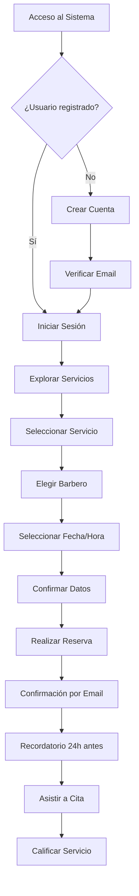
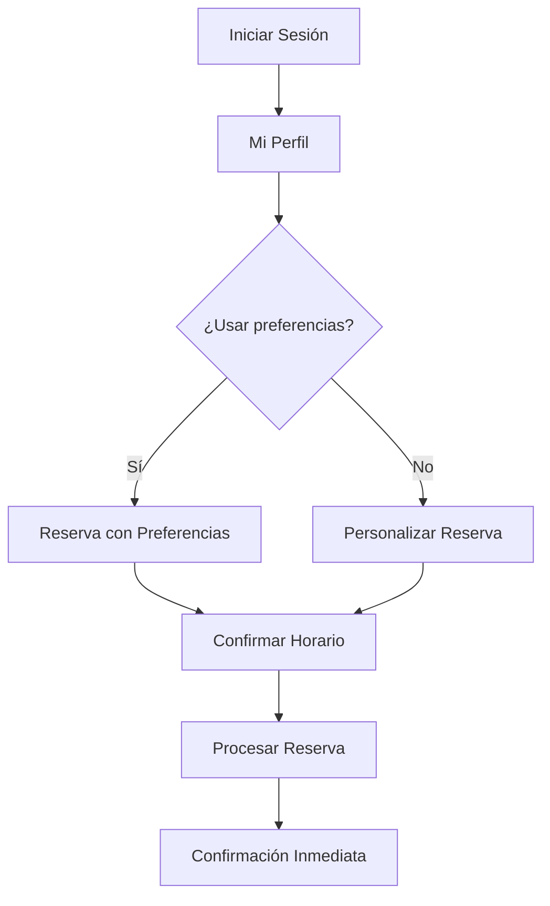
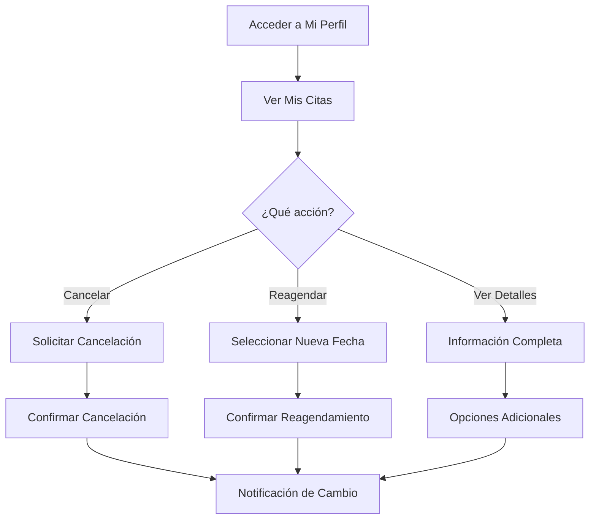
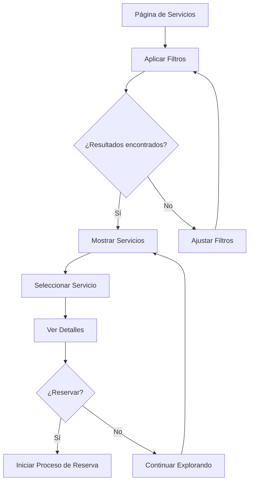
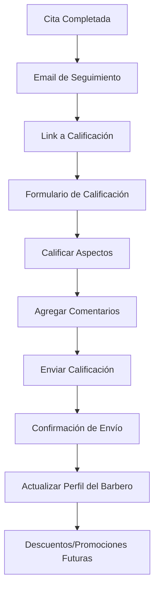

# Manual de Usuario - Sistema Barber Shop

## 📖 Introducción

### Bienvenido al Sistema Barber Shop

El **Sistema Barber Shop** es una plataforma web moderna diseñada para revolucionar la experiencia de reservas en barberías. Esta aplicación permite a los clientes reservar citas de manera fácil e intuitiva, consultar servicios disponibles, conocer a los barberos profesionales y gestionar sus reservas desde cualquier dispositivo.

### Propósito del Sistema

El sistema está diseñado para:
- **Simplificar el proceso de reservas** eliminando las llamadas telefónicas
- **Ofrecer transparencia** en precios, servicios y disponibilidad
- **Mejorar la experiencia del cliente** con una interfaz moderna e intuitiva
- **Optimizar la gestión** tanto para clientes como para el personal de la barbería

### Beneficios Principales

#### Para Clientes:
- ✅ **Reservas 24/7** - Disponible las 24 horas del día
- ✅ **Selección de barbero preferido** - Elige tu profesional favorito
- ✅ **Información detallada** - Precios, duración y descripción de servicios
- ✅ **Gestión de citas** - Consulta, modifica o cancela tus reservas
- ✅ **Sin esperas** - Sistema de citas programadas

#### Para la Barbería:
- ✅ **Gestión automatizada** - Reduce la carga administrativa
- ✅ **Optimización de horarios** - Mejor distribución de citas
- ✅ **Base de datos de clientes** - Historial y preferencias
- ✅ **Reducción de no-shows** - Sistema de recordatorios

---

## 🚀 Primeros Pasos

### Requisitos del Sistema

#### Dispositivos Compatibles:
- **Computadoras** (Windows, Mac, Linux)
- **Tablets** (iOS, Android)
- **Smartphones** (iOS, Android)

#### Navegadores Recomendados:
- Google Chrome 100+
- Mozilla Firefox 100+
- Safari 15+
- Microsoft Edge 100+

#### Conexión a Internet:
- Mínimo: 1 Mbps
- Recomendado: 5 Mbps o superior

### Acceso al Sistema

#### URL de Acceso:
```
https://barbershop.com
```

#### Primera Visita:
1. Abra su navegador web preferido
2. Ingrese la URL del sistema
3. La página principal se cargará automáticamente
4. No se requiere instalación adicional

---

## 🏠 Navegación Principal

### Estructura de la Página Principal

#### 1. **Barra de Navegación Superior**
```
[LOGO] Barber Shop    [Inicio] [Servicios] [Barberos] [Reservar] [Iniciar Sesión]
```

**Elementos de la navegación:**
- **Logo/Inicio:** Regresa a la página principal
- **Servicios:** Catálogo completo de servicios disponibles
- **Barberos:** Perfiles del equipo profesional
- **Reservar:** Acceso directo al sistema de reservas
- **Iniciar Sesión:** Acceso a cuenta personal (registro si es nuevo usuario)

#### 2. **Sección Hero (Principal)**
- **Título principal:** "Tu Mejor Estilo Te Espera"
- **Descripción:** Información sobre la barbería
- **Botones de acción:**
  - `Reservar Cita` - Acceso directo a reservas
  - `Ver Servicios` - Navega al catálogo

#### 3. **Estadísticas Destacadas**
- **1000+ Clientes Satisfechos**
- **5+ Años de Experiencia**
- **10+ Servicios Especializados**

#### 4. **Sección "¿Por Qué Elegirnos?"**
- ✅ **Profesionales Certificados**
- ⏰ **Reservas Online 24/7**
- ⭐ **Productos Premium**
- 👥 **Atención Personalizada**

#### 5. **Servicios Destacados**
- Muestra los servicios más populares
- Incluye precio y duración
- Botón directo para reservar

#### 6. **Nuestro Equipo**
- Perfiles de barberos destacados
- Calificaciones y especializaciones
- Opción de reservar con barbero específico

#### 7. **Llamada a la Acción Final**
- Botón principal de reserva
- Información de contacto telefónico

---

## 🔐 Instrucciones de Ingreso

### Registro de Nuevo Usuario

#### Paso 1: Acceso al Registro
1. Haga clic en **"Iniciar Sesión"** en la barra de navegación
2. En la página de login, seleccione **"Registrarse"** o **"Crear cuenta"**

#### Paso 2: Formulario de Registro
Complete los siguientes campos obligatorios:

```
┌─ INFORMACIÓN PERSONAL ─────────────────────┐
│ Nombre: [________________]                  │
│ Apellido: [________________]                │
│ Email: [________________]                   │
│ Teléfono: [________________]                │
│ Fecha de Nacimiento: [__/__/____]          │
│                                            │
│ CREDENCIALES DE ACCESO                     │
│ Contraseña: [________________]              │
│ Confirmar Contraseña: [________________]    │
│                                            │
│ □ Acepto términos y condiciones            │
│ □ Deseo recibir notificaciones promocionales│
│                                            │
│ [Registrarse] [Cancelar]                   │
└────────────────────────────────────────────┘
```

#### Paso 3: Verificación
1. Revise su correo electrónico
2. Haga clic en el enlace de verificación
3. Su cuenta estará activada

### Inicio de Sesión

#### Para Usuarios Registrados:
1. Haga clic en **"Iniciar Sesión"**
2. Ingrese sus credenciales:
   ```
   Email: [su_email@ejemplo.com]
   Contraseña: [su_contraseña]
   ```
3. Haga clic en **"Ingresar"**

#### Recuperación de Contraseña:
1. En la página de login, seleccione **"¿Olvidó su contraseña?"**
2. Ingrese su email registrado
3. Revise su correo para el enlace de recuperación
4. Cree una nueva contraseña

### Estados de Sesión

#### Usuario No Autenticado:
- Puede navegar por servicios y barberos
- Puede ver información general
- **No puede:** Hacer reservas o acceder a perfil

#### Usuario Autenticado:
- Acceso completo a todas las funcionalidades
- Puede realizar reservas
- Acceso a perfil personal y historial
- Gestión de citas programadas

---

## 🛍️ Catálogo de Servicios

### Acceso al Catálogo

#### Navegación:
1. Desde la página principal: Clic en **"Servicios"** en el menú
2. Desde la página principal: Clic en **"Ver Servicios"** en la sección hero
3. URL directa: `/services`

### Interfaz del Catálogo

#### Encabezado de Página:
```
┌─ NUESTROS SERVICIOS ──────────────────────────────────┐
│ Descubre nuestra completa gama de servicios           │
│ profesionales de barbería, diseñados para realzar     │
│ tu estilo personal con la máxima calidad.             │
└────────────────────────────────────────────────────────┘
```

#### Panel de Filtros:
```
┌─ FILTROS DE BÚSQUEDA ─────────────────────────────────┐
│ 🔍 Buscar: [_________________________] [🔍]          │
│                                                       │
│ Categoría: [Todas las categorías ▼]                   │
│ Precio: [Todos los precios ▼]                         │
│ Duración: [Cualquier duración ▼]                      │
│                                                       │
│ Filtros activos: [Búsqueda: "corte"] [×] [Limpiar]    │
└───────────────────────────────────────────────────────┘
```

### Opciones de Filtrado

#### 1. **Búsqueda por Texto**
- Busca en nombres y descripciones de servicios
- Búsqueda en tiempo real mientras escribe
- No distingue entre mayúsculas y minúsculas

#### 2. **Filtro por Categoría**
- **Cortes de Cabello:** Cortes tradicionales y modernos
- **Afeitado:** Afeitado clásico y con navaja
- **Cuidado de Barba:** Recorte, arreglo y tratamientos
- **Peinado:** Styling y peinados especiales
- **Tratamientos:** Cuidados especializados del cabello
- **Paquetes:** Combinaciones de servicios con descuento

#### 3. **Filtro por Precio**
- **$0 - $25:** Servicios básicos
- **$26 - $50:** Servicios estándar
- **$51 - $75:** Servicios premium
- **$76 - $100:** Servicios especializados
- **$100+:** Paquetes y servicios de lujo

#### 4. **Filtro por Duración**
- **Hasta 30 min:** Servicios rápidos
- **31 - 60 min:** Servicios estándar
- **61 - 90 min:** Servicios completos
- **Más de 90 min:** Paquetes extensos

### Tarjetas de Servicio

#### Información Mostrada:
```
┌─ CORTE CLÁSICO ──────────────────── $35 ┐
│ [Imagen del servicio]                    │
│ ⏱️ 45 min          🏷️ Cortes            │
│                                         │
│ Corte tradicional con tijeras y         │
│ máquina, incluye lavado y styling       │
│ básico.                                 │
│                                         │
│ Incluye:                                │
│ ✓ Lavado con shampoo                    │
│ ✓ Corte personalizado                   │
│ ✓ Styling básico                        │
│                                         │
│ ⏱️ 45 min    ⭐ Popular                 │
│                        [Reservar Cita] │
└─────────────────────────────────────────┘
```

#### Elementos de Cada Tarjeta:
- **Imagen:** Foto representativa del servicio
- **Nombre:** Título del servicio
- **Precio:** Costo en moneda local
- **Duración:** Tiempo estimado en minutos
- **Categoría:** Tipo de servicio
- **Descripción:** Explicación detallada
- **Características incluidas:** Lista de beneficios
- **Indicadores especiales:** "Popular", etc.
- **Botón de reserva:** Acceso directo al proceso de reserva

### Gestión de Resultados

#### Contador de Resultados:
```
📊 12 servicios encontrados
```

#### Estados de Visualización:

##### **Con Resultados:**
- Muestra grid de tarjetas organizadas
- Máximo 12 servicios por página
- Paginación si hay más resultados

##### **Sin Resultados:**
```
┌─ NO SE ENCONTRARON SERVICIOS ─────┐
│           🔍                      │
│                                   │
│ No hay servicios que coincidan    │
│ con los filtros seleccionados.    │
│ Intenta ajustar los criterios     │
│ de búsqueda.                      │
│                                   │
│        [Limpiar Filtros]          │
└───────────────────────────────────┘
```

##### **Cargando:**
```
┌─ CARGANDO SERVICIOS ──────────────┐
│           ⟳                      │
│    Cargando servicios...          │
└───────────────────────────────────┘
```

---

## 👨‍💼 Directorio de Barberos

### Acceso al Directorio

#### Navegación:
1. Desde el menú principal: **"Barberos"**
2. Desde la página de servicios: Enlaces a barberos específicos
3. URL directa: `/barbers`

### Información de Barberos

#### Tarjeta de Barbero:
```
┌─ CARLOS GONZÁLEZ ─────────────────────────┐
│ [Foto del barbero]          ⭐ 4.8        │
│                                           │
│ 8 años de experiencia                     │
│                                           │
│ Especializaciones:                        │
│ 🎯 Cortes Modernos  🎯 Barba              │
│                                           │
│ Horario: Lun-Sáb 9:00-18:00              │
│                                           │
│ "Especialista en cortes modernos y        │
│ técnicas de degradado. Certificado        │
│ internacional en barbería clásica."       │
│                                           │
│ [Ver Perfil] [Reservar con Carlos]        │
└───────────────────────────────────────────┘
```

#### Datos Mostrados:
- **Foto profesional**
- **Nombre completo**
- **Calificación promedio** (estrellas)
- **Años de experiencia**
- **Especializaciones principales**
- **Horarios de trabajo**
- **Biografía profesional**
- **Botones de acción**

### Perfil Detallado del Barbero

#### Información Completa:
```
┌─ PERFIL PROFESIONAL ─────────────────────────────────┐
│ CARLOS GONZÁLEZ                    ⭐ 4.8 (127 reseñas)│
│                                                       │
│ [Foto Grande]                                         │
│                                                       │
│ EXPERIENCIA: 8 años                                   │
│ SERVICIOS: 15 especializaciones                       │
│ CLIENTES ATENDIDOS: 850+                              │
│                                                       │
│ ESPECIALIZACIONES:                                    │
│ • Cortes modernos y clásicos                          │
│ • Degradados y fades                                  │
│ • Arreglo y diseño de barba                          │
│ • Afeitado con navaja                                 │
│ • Tratamientos capilares                              │
│                                                       │
│ HORARIOS DE TRABAJO:                                  │
│ Lunes - Viernes: 9:00 AM - 6:00 PM                   │
│ Sábados: 8:00 AM - 4:00 PM                           │
│ Domingos: Cerrado                                     │
│                                                       │
│ CERTIFICACIONES:                                      │
│ ✓ Barbería Clásica Internacional                      │
│ ✓ Técnicas Modernas de Corte                         │
│ ✓ Especialista en Cuidado de Barba                   │
│                                                       │
│ [Reservar Cita] [Ver Disponibilidad]                 │
└───────────────────────────────────────────────────────┘
```

### Disponibilidad del Barbero

#### Calendario de Disponibilidad:
```
┌─ DISPONIBILIDAD - CARLOS GONZÁLEZ ─────────────┐
│                                               │
│ Semana del 18 - 24 Agosto 2025               │
│                                               │
│ LUN 18  MAR 19  MIE 20  JUE 21  VIE 22  SAB 23│
│   ✓       ✓       ✓       ✓       ✓       ✓  │
│                                               │
│ Horarios disponibles para Lunes 18:          │
│ 🟢 9:00 AM   🟢 10:30 AM  🔴 12:00 PM        │
│ 🟢 2:00 PM   🔴 3:30 PM   🟢 5:00 PM         │
│                                               │
│ 🟢 Disponible  🔴 Ocupado  ⚪ No laboral       │
│                                               │
│ [Seleccionar Horario]                         │
└───────────────────────────────────────────────┘
```

---

## 📅 Sistema de Reservas

### Acceso al Sistema de Reservas

#### Puntos de Entrada:
1. **Botón principal:** "Reservar Cita" en página principal
2. **Desde servicios:** "Reservar" en tarjeta de servicio
3. **Desde barberos:** "Reservar con [Nombre]"
4. **Menú de navegación:** "Reservar"

### Proceso de Reserva (Wizard de 4 Pasos)

#### **PASO 1: Selección de Servicios**

```
┌─ SELECCIONA TUS SERVICIOS ─── Paso 1 de 4 ────┐
│                                                │
│ ● Servicios  ○ Barbero  ○ Fecha/Hora  ○ Confirmar│
│                                                │
│ Servicios Disponibles:                         │
│                                                │
│ □ Corte Clásico           $35    45 min       │
│ □ Arreglo de Barba        $20    30 min       │
│ □ Afeitado Completo       $25    30 min       │
│ □ Corte + Barba          $50    60 min       │
│                                                │
│ SERVICIOS SELECCIONADOS:                       │
│ ✓ Corte Clásico          $35    45 min       │
│ ✓ Arreglo de Barba       $20    30 min       │
│                                                │
│ Total: $55               75 min                │
│                                                │
│ [Anterior] [Continuar →]                       │
└────────────────────────────────────────────────┘
```

**Funcionalidades:**
- ✅ Selección múltiple de servicios
- ✅ Cálculo automático de precio total
- ✅ Cálculo automático de duración total
- ✅ Vista previa de servicios seleccionados
- ✅ Posibilidad de añadir/quitar servicios

#### **PASO 2: Selección de Barbero**

```
┌─ ELIGE TU BARBERO ────────── Paso 2 de 4 ─────┐
│                                                │
│ ○ Servicios  ● Barbero  ○ Fecha/Hora  ○ Confirmar│
│                                                │
│ Barberos Disponibles para tus servicios:       │
│                                                │
│ ○ CARLOS GONZÁLEZ                              │
│   ⭐ 4.8  •  8 años exp.  •  Disponible hoy   │
│   Especialista en cortes modernos              │
│                                                │
│ ● MIGUEL RODRÍGUEZ                             │
│   ⭐ 4.9  •  10 años exp.  •  Disponible hoy  │
│   Experto en barbería clásica                  │
│                                                │
│ ○ CUALQUIER BARBERO DISPONIBLE                 │
│   El sistema asignará el mejor barbero         │
│   disponible para tu horario                   │
│                                                │
│ BARBERO SELECCIONADO:                          │
│ Miguel Rodríguez - Experto en barbería clásica │
│                                                │
│ [← Anterior] [Continuar →]                     │
└────────────────────────────────────────────────┘
```

**Funcionalidades:**
- ✅ Lista de barberos compatibles con servicios
- ✅ Información de cada barbero (rating, experiencia)
- ✅ Indicadores de disponibilidad
- ✅ Opción de "Cualquier barbero"
- ✅ Preview del barbero seleccionado

#### **PASO 3: Selección de Fecha y Hora**

```
┌─ FECHA Y HORA ───────────── Paso 3 de 4 ──────┐
│                                                │
│ ○ Servicios  ○ Barbero  ● Fecha/Hora  ○ Confirmar│
│                                                │
│ AGOSTO 2025                [← → ]               │
│                                                │
│ Dom Lun Mar Mie Jue Vie Sab                   │
│     12  13  14  15  16  17                    │
│ 18  19  20  21  22  23  24                    │
│ 25  26  27  28  29  30  31                    │
│                                                │
│ Fecha seleccionada: Lunes, 18 de Agosto       │
│                                                │
│ HORARIOS DISPONIBLES:                          │
│ ○ 9:00 AM   ○ 10:30 AM  ● 2:00 PM            │
│ ○ 3:30 PM   ○ 5:00 PM                        │
│                                                │
│ Duración estimada: 75 minutos                  │
│ Hora de finalización: 3:15 PM                 │
│                                                │
│ [← Anterior] [Continuar →]                     │
└────────────────────────────────────────────────┘
```

**Funcionalidades:**
- ✅ Calendario visual interactivo
- ✅ Solo fechas disponibles son seleccionables
- ✅ Horarios filtrados por barbero y duración
- ✅ Cálculo automático de hora de finalización
- ✅ Navegación por meses

#### **PASO 4: Confirmación y Datos**

```
┌─ CONFIRMAR RESERVA ──────── Paso 4 de 4 ──────┐
│                                                │
│ ○ Servicios  ○ Barbero  ○ Fecha/Hora  ● Confirmar│
│                                                │
│ RESUMEN DE TU RESERVA:                         │
│                                                │
│ 📅 Fecha: Lunes, 18 de Agosto de 2025         │
│ ⏰ Hora: 2:00 PM - 3:15 PM                     │
│ 👨‍💼 Barbero: Miguel Rodríguez                   │
│                                                │
│ SERVICIOS:                                     │
│ • Corte Clásico (45 min)           $35        │
│ • Arreglo de Barba (30 min)        $20        │
│                                                │
│ TOTAL: $55                                     │
│                                                │
│ INFORMACIÓN PERSONAL:                          │
│ Nombre: [Juan Pérez        ]                   │
│ Teléfono: [(555) 123-4567   ]                  │
│ Email: [juan@email.com     ]                   │
│                                                │
│ NOTAS ESPECIALES (Opcional):                   │
│ [Tengo alergia a ciertos productos...        ] │
│                                                │
│ □ Acepto términos y condiciones                │
│ □ Quiero recibir recordatorio por SMS         │
│                                                │
│ [← Anterior] [Confirmar Reserva]               │
└────────────────────────────────────────────────┘
```

### Confirmación de Reserva

#### Página de Confirmación:
```
┌─ ¡RESERVA CONFIRMADA! ─────────────────────────┐
│                   ✅                           │
│                                                │
│ Tu cita ha sido reservada exitosamente        │
│                                                │
│ DETALLES DE TU CITA:                          │
│ Número de reserva: #BR-2025-001234            │
│ Fecha: Lunes, 18 de Agosto de 2025           │
│ Hora: 2:00 PM - 3:15 PM                      │
│ Barbero: Miguel Rodríguez                     │
│ Servicios: Corte Clásico, Arreglo de Barba   │
│ Total: $55                                    │
│                                                │
│ PRÓXIMOS PASOS:                               │
│ • Recibirás confirmación por email            │
│ • Te enviaremos recordatorio 24h antes        │
│ • Puedes gestionar tu cita desde tu perfil    │
│                                                │
│ [Ver Mi Perfil] [Nueva Reserva] [Inicio]      │
└────────────────────────────────────────────────┘
```

#### Notificaciones Automáticas:
- **Email de confirmación** inmediato
- **SMS de recordatorio** 24 horas antes
- **Email de recordatorio** 2 horas antes
- **Notificación de cancelación** si aplica

---

## 👤 Gestión de Perfil Personal

### Acceso al Perfil

#### Una vez autenticado:
- **Menú usuario:** Clic en nombre de usuario → "Mi Perfil"
- **Después de reserva:** "Ver Mi Perfil"
- **URL directa:** `/profile`

### Panel de Control Personal

#### Vista General del Perfil:
```
┌─ MI PERFIL ─────────────────────────────────────────┐
│                                                     │
│ [Foto]  JUAN PÉREZ                    Cliente desde │
│         juan@email.com                    Ago 2025  │
│         (555) 123-4567                              │
│                                                     │
│ ┌─ ESTADÍSTICAS ──────────────────────────────────┐ │
│ │ Citas Realizadas: 5                             │ │
│ │ Barbero Favorito: Miguel Rodríguez              │ │
│ │ Servicio Favorito: Corte Clásico                │ │
│ │ Próxima Cita: 18 Ago, 2:00 PM                  │ │
│ └─────────────────────────────────────────────────┘ │
│                                                     │
│ ACCIONES RÁPIDAS:                                   │
│ [Nueva Reserva] [Mis Citas] [Editar Perfil]        │
└─────────────────────────────────────────────────────┘
```

### Gestión de Citas

#### Mis Reservas:
```
┌─ MIS CITAS ─────────────────────────────────────────┐
│                                                     │
│ Filtros: [Todas ▼] [Este mes ▼]                     │
│                                                     │
│ PRÓXIMAS CITAS:                                     │
│                                                     │
│ ┌─ LUNES 18 AGOSTO ──────────────────── #BR-001234 ┐│
│ │ ⏰ 2:00 PM - 3:15 PM                             ││
│ │ 👨‍💼 Miguel Rodríguez                              ││
│ │ 💇 Corte Clásico + Arreglo de Barba              ││
│ │ 💰 $55                                           ││
│ │ 📍 Estado: Confirmada                            ││
│ │                                                  ││
│ │ [Ver Detalles] [Reagendar] [Cancelar]           ││
│ └──────────────────────────────────────────────────┘│
│                                                     │
│ HISTORIAL:                                          │
│                                                     │
│ ┌─ MIÉRCOLES 14 AGOSTO ────────────── #BR-001230 ┐ │
│ │ ✅ Completada - Corte Degradado                 │ │
│ │ 👨‍💼 Carlos González                              │ │
│ │ ⭐⭐⭐⭐⭐ Calificado                              │ │
│ │                                                 │ │
│ │ [Ver Detalles] [Reservar Nuevamente]           │ │
│ └─────────────────────────────────────────────────┘ │
│                                                     │
│ [Ver Todo el Historial]                             │
└─────────────────────────────────────────────────────┘
```

### Estados de Citas

#### Estados Posibles:
- **🟡 Pendiente:** Esperando confirmación del barbero
- **🟢 Confirmada:** Cita aprobada y programada
- **🔵 En Proceso:** Actualmente siendo atendido
- **✅ Completada:** Servicio finalizado exitosamente
- **🔴 Cancelada:** Cita cancelada por usuario o barbería
- **⚪ No Asistió:** Cliente no se presentó a la cita

### Edición de Perfil

#### Formulario de Edición:
```
┌─ EDITAR PERFIL ────────────────────────────────────┐
│                                                    │
│ INFORMACIÓN PERSONAL:                              │
│                                                    │
│ Foto de Perfil: [Subir Nueva] [Eliminar]          │
│ [Imagen actual]                                    │
│                                                    │
│ Nombre: [Juan                ]                     │
│ Apellido: [Pérez              ]                    │
│ Email: [juan@email.com       ]                     │
│ Teléfono: [(555) 123-4567     ]                    │
│ Fecha Nacimiento: [15/03/1990 ]                    │
│                                                    │
│ PREFERENCIAS:                                      │
│                                                    │
│ Barbero Preferido: [Miguel Rodríguez ▼]           │
│ Servicios Favoritos:                               │
│ ☑ Corte Clásico    ☑ Arreglo de Barba            │
│ ☐ Afeitado         ☐ Tratamientos                 │
│                                                    │
│ NOTIFICACIONES:                                    │
│                                                    │
│ ☑ Email de confirmación                           │
│ ☑ SMS de recordatorio                             │
│ ☐ Ofertas promocionales                           │
│ ☑ Nuevos servicios                                │
│                                                    │
│ SEGURIDAD:                                         │
│                                                    │
│ [Cambiar Contraseña] [Autenticación 2FA]          │
│                                                    │
│ [Guardar Cambios] [Cancelar]                       │
└────────────────────────────────────────────────────┘
```

---

## 🔧 Funciones Especializadas

### Búsqueda Avanzada

#### Búsqueda Global:
```
┌─ BÚSQUEDA AVANZADA ────────────────────────────────┐
│                                                    │
│ 🔍 [corte barba                    ] [Buscar]      │
│                                                    │
│ FILTROS:                                           │
│ Tipo: ☑ Servicios ☑ Barberos ☐ Promociones       │
│ Precio: [$20] - [$80]                             │
│ Duración: [30] - [120] minutos                     │
│ Disponibilidad: [Hoy ▼]                           │
│                                                    │
│ RESULTADOS (8 encontrados):                        │
│                                                    │
│ SERVICIOS (3):                                     │
│ • Corte + Barba Completo - $50                    │
│ • Arreglo de Barba Premium - $35                  │
│ • Combo Corte y Barba - $45                       │
│                                                    │
│ BARBEROS (2):                                      │
│ • Miguel Rodríguez - Especialista en barba        │
│ • Carlos González - Experto en cortes              │
│                                                    │
│ [Ver Todos los Resultados]                         │
└────────────────────────────────────────────────────┘
```

### Sistema de Calificaciones

#### Calificar Servicio:
```
┌─ CALIFICAR SERVICIO ───────────────────────────────┐
│                                                    │
│ Cita: #BR-001230                                   │
│ Fecha: 14 Agosto 2025                             │
│ Barbero: Carlos González                           │
│ Servicio: Corte Degradado                         │
│                                                    │
│ ¿Cómo calificarías tu experiencia?                │
│                                                    │
│ SERVICIO GENERAL:                                  │
│ ⭐⭐⭐⭐⭐ (5 estrellas)                            │
│                                                    │
│ CALIDAD DEL CORTE:                                 │
│ ⭐⭐⭐⭐⭐ (5 estrellas)                            │
│                                                    │
│ ATENCIÓN AL CLIENTE:                               │
│ ⭐⭐⭐⭐⭐ (5 estrellas)                            │
│                                                    │
│ PUNTUALIDAD:                                       │
│ ⭐⭐⭐⭐⭐ (5 estrellas)                            │
│                                                    │
│ COMENTARIOS (Opcional):                            │
│ [Excelente servicio, muy profesional y           ] │
│ [atento. Quedé muy satisfecho con el resultado.  ] │
│ [Recomiendo ampliamente.                          ] │
│                                                    │
│ [Enviar Calificación] [Cancelar]                   │
└────────────────────────────────────────────────────┘
```

### Notificaciones y Recordatorios

#### Centro de Notificaciones:
```
┌─ NOTIFICACIONES ───────────────────────────────────┐
│                                                    │
│ 🔔 3 nuevas notificaciones                         │
│                                                    │
│ HOY:                                               │
│                                                    │
│ 🔴 RECORDATORIO - 2 horas                         │
│ Tu cita con Miguel Rodríguez es en 2 horas        │
│ Lunes 18 Agosto, 2:00 PM                         │
│ [Ver Detalles] [Recordar en 30min]               │
│                                                    │
│ AYER:                                              │
│                                                    │
│ ✅ CONFIRMACIÓN                                    │
│ Tu reserva #BR-001234 ha sido confirmada          │
│ [Ver Cita]                                         │
│                                                    │
│ 📢 PROMOCIÓN                                       │
│ ¡20% descuento en paquetes este mes!              │
│ [Ver Ofertas] [Descartar]                         │
│                                                    │
│ [Marcar todas como leídas] [Configurar]           │
└────────────────────────────────────────────────────┘
```

### Reagendamiento de Citas

#### Proceso de Reagendamiento:
```
┌─ REAGENDAR CITA ───────────────────────────────────┐
│                                                    │
│ CITA ACTUAL:                                       │
│ #BR-001234                                         │
│ Lunes 18 Agosto, 2:00 PM                         │
│ Miguel Rodríguez                                   │
│                                                    │
│ SELECCIONA NUEVA FECHA:                            │
│                                                    │
│ AGOSTO 2025         [← → ]                         │
│ Dom Lun Mar Mie Jue Vie Sab                      │
│     12  13  14  15  16  17                        │
│ 18  [19] 20  21  22  23  24                       │
│ 25  26  27  28  29  30  31                        │
│                                                    │
│ HORARIOS DISPONIBLES (Martes 19):                 │
│ ○ 9:00 AM   ● 11:00 AM  ○ 3:00 PM                │
│ ○ 4:30 PM                                         │
│                                                    │
│ NUEVA CITA:                                        │
│ Martes 19 Agosto, 11:00 AM                       │
│ Miguel Rodríguez                                   │
│ Mismo servicio (Corte + Barba)                    │
│                                                    │
│ ⚠️ Política de reagendamiento:                     │
│ - Permitido hasta 24h antes                       │
│ - Sin costo adicional                             │
│                                                    │
│ [Confirmar Cambio] [Cancelar]                      │
└────────────────────────────────────────────────────┘
```

---

## 📱 Flujos de Trabajo Principales

### Flujo 1: Cliente Nuevo - Primera Reserva



#### Tiempo Estimado: **5-8 minutos** para primera reserva

### Flujo 2: Cliente Habitual - Reserva Rápida



#### Tiempo Estimado: **2-3 minutos** para clientes habituales

### Flujo 3: Gestión de Cita Existente



### Flujo 4: Búsqueda y Filtrado de Servicios



### Flujo 5: Proceso de Calificación Post-Servicio



---

## 🆘 Solución de Problemas Comunes

### Problemas de Acceso

#### **No puedo iniciar sesión**

**Síntomas:**
- Mensaje "Credenciales incorrectas"
- Página no responde al hacer login

**Soluciones:**
1. **Verificar credenciales:**
   - Comprobar email y contraseña
   - Verificar tecla Caps Lock
   - Intentar escribir manualmente (no copiar/pegar)

2. **Recuperar contraseña:**
   - Clic en "¿Olvidó su contraseña?"
   - Revisar email (incluyendo spam)
   - Seguir instrucciones del email

3. **Limpiar caché del navegador:**
   - Ctrl + Shift + R (Windows)
   - Cmd + Shift + R (Mac)

4. **Contactar soporte:**
   - Email: soporte@barbershop.com
   - Teléfono: (555) 123-4567

#### **No recibo emails de confirmación**

**Verificaciones:**
1. Revisar carpeta de spam/correo no deseado
2. Verificar que el email esté escrito correctamente
3. Revisar filtros de email
4. Intentar con otro proveedor de email

### Problemas con Reservas

#### **No hay horarios disponibles**

**Posibles causas:**
- Barbero muy solicitado
- Fecha muy próxima
- Duración del servicio muy larga

**Soluciones:**
1. **Flexibilizar horarios:**
   - Probar diferentes horas del día
   - Considerar días alternativos
   - Elegir "Cualquier barbero"

2. **Reservar con anticipación:**
   - Planificar citas con 3-7 días de anticipación
   - Activar notificaciones de disponibilidad

3. **Contacto directo:**
   - Llamar a la barbería: (555) 123-4567
   - Preguntar por cancelaciones de último minuto

#### **Error al procesar reserva**

**Pasos de solución:**
1. **Verificar conexión a internet**
2. **Recargar la página** (F5)
3. **Intentar en modo incógnito**
4. **Usar otro navegador**
5. **Contactar soporte técnico**

### Problemas de Visualización

#### **Página no carga correctamente**

**Soluciones rápidas:**
1. **Actualizar navegador:**
   - Chrome: chrome://settings/help
   - Firefox: Menú → Ayuda → Acerca de Firefox
   - Safari: Safari → Acerca de Safari

2. **Verificar JavaScript:**
   - Debe estar habilitado
   - chrome://settings/content/javascript

3. **Desactivar extensiones:**
   - Modo incógnito para probar
   - Deshabilitar bloqueadores de anuncios temporalmente

#### **Problemas en dispositivos móviles**

**Optimizaciones:**
1. **Usar navegador actualizado**
2. **Verificar memoria disponible**
3. **Cerrar otras aplicaciones**
4. **Usar conexión WiFi estable**

### Problemas de Notificaciones

#### **No recibo recordatorios SMS**

**Verificaciones:**
1. **Número de teléfono correcto** en el perfil
2. **Formato internacional:** +57 300 123 4567
3. **Configuración de notificaciones** activada
4. **Verificar bloqueo de SMS** automáticos

#### **Muchas notificaciones por email**

**Configuración:**
1. Ir a **Mi Perfil → Configuración**
2. Ajustar **Preferencias de Notificación**
3. Desmarcar notificaciones no deseadas
4. Guardar cambios

---

## 📞 Soporte y Contacto

### Canales de Soporte

#### **Soporte Técnico**
- **Email:** soporte@barbershop.com
- **Teléfono:** (555) 123-4567
- **Horario:** Lunes a Viernes, 9:00 AM - 6:00 PM
- **Tiempo de respuesta:** 24-48 horas

#### **Reservas y Consultas**
- **Teléfono directo:** (555) 987-6543
- **WhatsApp:** +57 300 123 4567
- **Horario:** Lunes a Sábado, 8:00 AM - 7:00 PM

#### **Centro de Ayuda Online**
- **URL:** barbershop.com/ayuda
- **FAQ:** Preguntas frecuentes
- **Tutoriales:** Videos explicativos
- **Chatbot:** Asistencia automática 24/7

### Información de Contacto

#### **Dirección Física**
```
Barber Shop Premium
Carrera 15 #93-47
Bogotá, Colombia
```

#### **Redes Sociales**
- **Instagram:** @barbershoppremium
- **Facebook:** /barbershoppremium
- **TikTok:** @barbershoppremium

### Políticas Importantes

#### **Política de Cancelación**
- **Gratuita:** Hasta 24 horas antes
- **Parcial:** 12-24 horas antes (50% del costo)
- **Sin reembolso:** Menos de 12 horas

#### **Política de Reagendamiento**
- **Sin costo:** Una vez por reserva
- **Máximo:** 48 horas de anticipación
- **Límite:** 2 reagendamientos por mes

#### **Política de Privacidad**
- Datos personales protegidos según GDPR
- No compartimos información con terceros
- Derecho a eliminar cuenta y datos

---

## 📚 Glosario de Términos

### Términos del Sistema

**Barbero:** Profesional certificado que ofrece servicios de corte y cuidado personal

**Cita/Reserva:** Agendamiento de uno o más servicios con fecha y hora específica

**Perfil:** Cuenta personal del usuario con información y preferencias

**Servicio:** Procedimiento específico ofrecido por la barbería (corte, afeitado, etc.)

**Slot/Horario:** Espacio de tiempo disponible para agendar una cita

### Términos Técnicos

**Dashboard:** Panel de control personal del usuario

**Filtros:** Herramientas para refinar búsquedas y resultados

**Responsive:** Diseño que se adapta a diferentes tamaños de pantalla

**Widget:** Elemento interactivo de la interfaz (calendario, selector, etc.)

**Wizard:** Proceso paso a paso para completar una tarea compleja

### Estados y Notificaciones

**Confirmada:** Cita aprobada y programada definitivamente

**Pendiente:** Reserva en espera de confirmación del barbero

**Completada:** Servicio finalizado exitosamente

**Reagendada:** Cita movida a nueva fecha/hora

**Cancelada:** Cita anulada por el cliente o la barbería

---

**Manual de Usuario - Versión 1.0**  
**Fecha de creación:** 18 de Agosto de 2025  
**Última actualización:** 18 de Agosto de 2025  

*Para consultas sobre este manual, contacte al equipo de soporte técnico.*
